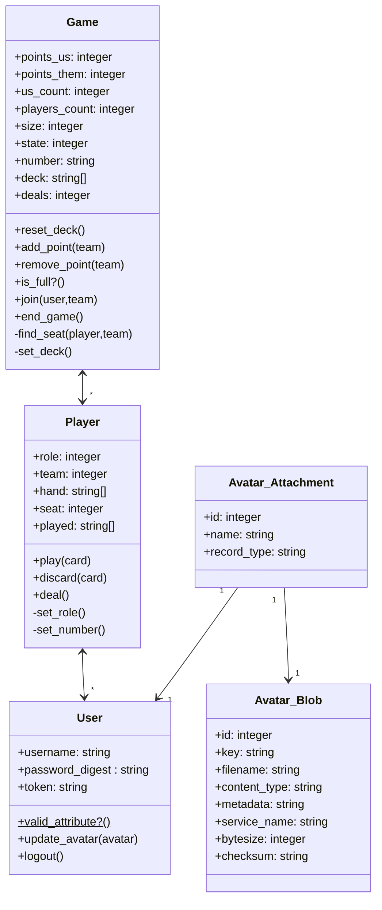

# Api CardGame
Se desarrolló el back-end del juego de cartas con Ruby on Rails, utilizando la gem bcrypt para la gestión de las passwords y jwt para la generar y validar los JSON Web Tokens.
## Diagrama de Clases

## Endpoints
### User
| Ruta | Endpoint | Descripción | Success | Error |
| ---- | -------- | ----------- | ------- | ----- |
|GET /users|index||||
|GET /users|show||||
|POST /users|create||||
|PUT /user|update||||
|DELETE /user|||||
||||||
||||||
||||||
||||||
||||||
||||||